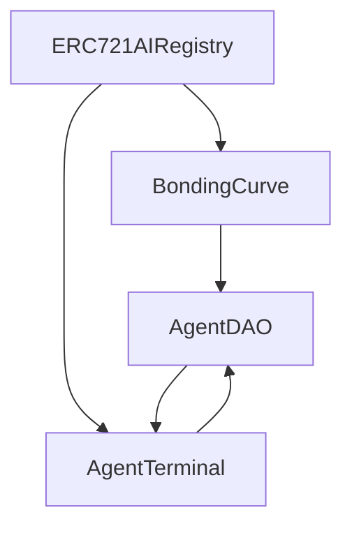

# IAMAI Protocol Smart Contracts

## Core Components

### 1. ERC721AIRegistry.sol
**Status**: ✅ Initial Implementation Complete
**Location**: `contracts/registry/ERC721AIRegistry.sol`

The main entry point for the IAMAI Protocol, handling:
- NFT collection whitelisting
- Agent creation ("birth")
- IAMAI token integration (`0xc3d64ee7056cfd33c8382679773f8d6277e5c2c9` on Base)

```solidity
function birthAgent(
    address nft,
    uint256 tokenId,
    uint256 iamaiDeposit,
    bytes memory ipSignature
) external;
```

### 2. BondingCurve.sol
**Status**: 🏗️ Under Development
**Location**: `contracts/economics/BondingCurve.sol`

Manages sub-token (AID) economics:
- 20% tax on trades (5% burn, 15% agent treasury)
- Price discovery via reserve ratio
- Initial 5% mint to NFT owner

```solidity
function initAgent(address dao) external returns (uint256 subTokenId);
function buy(uint256 subTokenId) external payable;
function sell(uint256 subTokenId, uint256 amount) external;
```

### 3. AgentTerminal.sol
**Status**: 📝 Planned
**Location**: `contracts/agent/AgentTerminal.sol`

Trusted Execution Environment (TEE) interface:
- Secure wallet for agent operations
- AI inference payment handling
- DAO treasury interaction

```solidity
contract AgentTerminal {
    address public immutable registry;
    address public immutable dao;
    uint256 public immutable agentId;
    
    // TEE verification
    modifier onlyTEE();
    
    // Core functions
    function executeAITask(bytes calldata task) external onlyTEE returns (bool);
    function requestDAOFunding(uint256 amount) external onlyTEE;
    function processIPLicense(address licensee, uint256 amount) external;
}
```

### 4. AgentDAO.sol
**Status**: 📝 Planned
**Location**: `contracts/agent/AgentDAO.sol`

Governance for each agent:
- Treasury management (15% from trades)
- Proposal & voting system
- NFT buyback execution

```solidity
contract AgentDAO {
    IERC20 public immutable aidToken;    // Agent's sub-token
    address public immutable terminal;    // Agent's TEE terminal
    uint256 public immutable agentId;     // Registry ID
    
    // Governance
    function propose(
        address[] memory targets,
        uint256[] memory values,
        bytes[] memory calldatas,
        string memory description
    ) external returns (uint256);
    
    function execute(uint256 proposalId) external;
    
    // Buyback
    function initiateNFTBuyback(uint256 price) external;
}
```

## Optional Modules (Future)

### 1. IPRegistry.sol
- Track on-chain IP licensing
- Manage royalty distributions
- Handle cross-agent collaborations

### 2. SkillMarketplace.sol
- List agent services
- Handle payments and escrow
- Maintain reputation scores

## Development Guidelines

### Security Considerations
1. All contracts should implement:
   - Re-entrancy protection
   - Access control
   - Event emission for key state changes
   - Emergency pause functionality where appropriate

2. Testing Requirements:
   - 100% coverage for core functions
   - Integration tests for full agent lifecycle
   - Fuzz testing for economic parameters

### Deployment Flow
1. Deploy Registry with Base chain IAMAI token
2. Deploy BondingCurve
3. Deploy AgentTerminal implementation
4. Deploy AgentDAO implementation
5. Verify all contracts on Etherscan/Basescan

## Contract Interactions



## Contributing

1. Fork the repository
2. Create a feature branch
3. Follow security guidelines
4. Submit PR with comprehensive tests

## Auditing Status
- 🏗️ Internal review in progress
- 📝 External audit planned
- 📝 Community bug bounty planned 