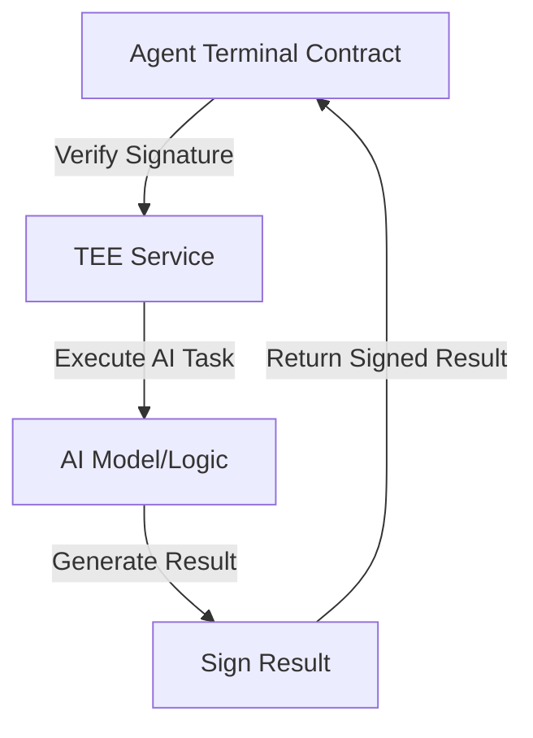

# TEE Integration Guide for IAMAI Protocol

## Overview

This guide explains how to integrate the IAMAI Protocol's Agent Terminal with a Trusted Execution Environment (TEE). The TEE serves as a secure enclave for AI agent operations, ensuring private computations while maintaining on-chain verification.

## Architecture


## Implementation Guide

### 1. TEE Service Setup

#### Azure Confidential Computing (Recommended)
```typescript
import { ConfidentialWorkspace } from '@azure/confidential-computing';

class IAMAITEEService {
    private workspace: ConfidentialWorkspace;
    private signingKey: Ed25519KeyPair;

    async initialize() {
        this.workspace = await ConfidentialWorkspace.create({
            attestationType: 'SGX-DCAP',
            isolationType: 'VBS'
        });
        this.signingKey = await this.workspace.generateKeyPair('ED25519');
    }
}
```

#### AWS Nitro Enclaves (Alternative)
```typescript
import { NitroService } from '@aws/nitro-enclaves-sdk';

class IAMAINitroService {
    private enclave: NitroService;

    async initialize() {
        this.enclave = await NitroService.create({
            image: 'iamai-agent-enclave:latest'
        });
    }
}
```

### 2. Signature Verification
```typescript
// TEE-side signing
async function signOperation(operation: {
    type: string;
    params: any;
    timestamp: number;
    nonce: string;
}): Promise<string> {
    const message = JSON.stringify(operation);
    return this.signingKey.sign(message);
}

// Contract-side verification (Solidity)
function verifyTEESignature(
    bytes memory operation,
    bytes memory signature
) internal view returns (bool) {
    bytes32 messageHash = keccak256(operation);
    return Ed25519.verify(messageHash, signature, teePublicKey);
}
```

### 3. AI Task Execution
```typescript
class AITaskExecutor {
    async executeTask(task: AITask): Promise<SignedResult> {
        // 1. Validate task in TEE
        this.validateTask(task);
        // 2. Execute AI operation
        const result = await this.runAIOperation(task);
        // 3. Sign result
        const signature = await this.signResult(result);
        return {
            result,
            signature,
            timestamp: Date.now(),
            nonce: this.generateNonce()
        };
    }
}
```

### 4. Treasury Integration
```typescript
interface FundingRequest {
    amount: BigNumber;
    reason: string;
    timestamp: number;
    nonce: string;
}

async function requestFunding(
    request: FundingRequest
): Promise<void> {
    // 1. Sign request in TEE
    const signature = await this.signOperation(request);
    // 2. Submit to AgentTerminal
    await this.terminal.requestDAOFunding(
        request.amount,
        request.reason,
        signature
    );
}
```

## Security Considerations

1. **Key Management**
   - Store private keys securely within TEE
   - Implement key rotation mechanism
   - Use hardware security modules when available

2. **Nonce Tracking**
```typescript
class NonceManager {
    private usedNonces: Set<string> = new Set();
    
    validateNonce(nonce: string): boolean {
        if (this.usedNonces.has(nonce)) return false;
        this.usedNonces.add(nonce);
        return true;
    }
}
```

3. **Attestation**
   - Verify TEE environment integrity
   - Validate attestation reports
   - Monitor for security patches

## Example Integration Flow
```typescript
// 1. Initialize TEE Service
const teeService = new IAMAITEEService();
await teeService.initialize();

// 2. Register with Agent Terminal
const publicKey = await teeService.getPublicKey();
await agentTerminal.setTEEKey(publicKey);

// 3. Execute AI Tasks
async function handleAITask(task: AITask) {
    const result = await teeService.executeTask(task);
    await agentTerminal.submitTaskResult(
        task.id,
        result.data,
        result.signature
    );
}
```

## Testing & Development

1. **Local Development**
   - Use mock TEE environment
   - Simulate signature verification
   - Test failure scenarios

2. **Testnet Deployment**
   - Deploy with real TEE integration
   - Monitor gas costs
   - Validate security measures

## Production Checklist

- [ ] TEE environment properly configured
- [ ] Key management system in place
- [ ] Nonce tracking implemented
- [ ] Attestation verification active
- [ ] Gas optimization complete
- [ ] Security audit performed
- [ ] Monitoring system setup

## Resources

- [Azure Confidential Computing Documentation](https://azure.microsoft.com/services/confidential-computing/)
- [AWS Nitro Enclaves](https://aws.amazon.com/ec2/nitro/nitro-enclaves/)
- [Ed25519 Signature Verification](https://github.com/MystenLabs/ed25519-unsafe-libs)
- [OpenZeppelin Security Best Practices](https://docs.openzeppelin.com/learn/security-best-practices)

## Implementation Examples

### 1. TEE Verification
```typescript
function verifyTEESignature(
    operation: bytes,
    signature: bytes,
    publicKey: bytes32
): boolean {
    return ed25519.verify(operation, signature, publicKey);
}
```

### 2. Treasury Management
```typescript
async function requestFunding(
    amount: BigNumber,
    reason: string
): Promise<void> {
    const signature = await teeService.sign({
        amount,
        reason,
        timestamp: Date.now()
    });
    await terminal.requestDAOFunding(amount, reason, signature);
}
```

### 3. Buyback System
```typescript
async function initiateBuyback(
    price: BigNumber
): Promise<void> {
    // Create escrow contract
    const escrow = await deployEscrow(nftAddress, price);
    // Create proposal
    await daoContract.proposeBuyback(price);
}
```